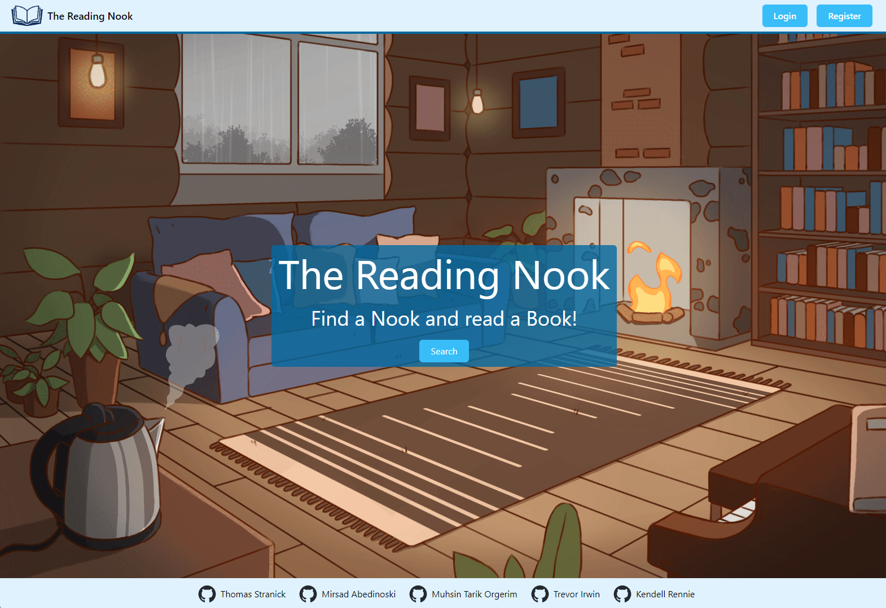
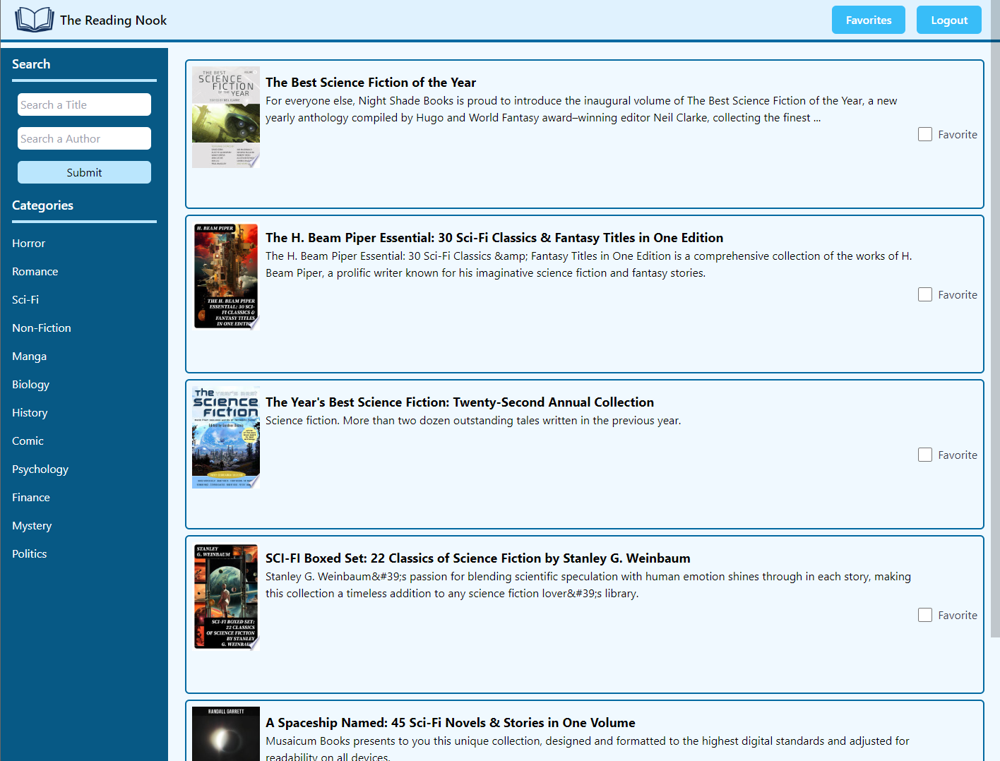
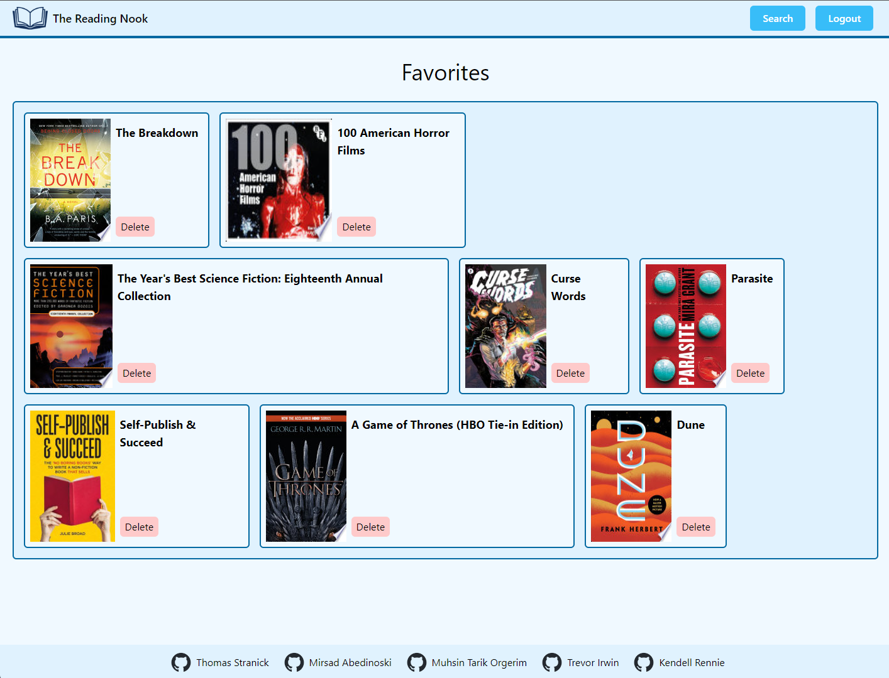

# The Reading Nook

## Authors: Thomas Stranick, Mirsad Abedinoski, Muhsin Tarik Ogerim, Trevor Irwin, Kendell Rennie

## Description 

Welcome to The Reading Nook! This application is your cozy corner on the internet, designed to provide users with a platform to explore, and favorite books. Similar to Yelp, users can rate books they've read and mark their favorites for future reference.

## Screenshots

## Installation
N/A, Please refer to the deployed web app in Deployment.

## Usage
### Features
* User Authentication: Users can sign up, log in, and log out securely using bcrypt for password encryption and express-session for session management.
* Book Search and Listing: Logged-in users can search for books by title, author, genre, and view detailed information about each book. As well as add books to their favorites.
* Favoriting: Logged-in users can add and delete books as favorites, that then show up in their favorites section. Cookies through current sessions allows users to view their own favorites, and not another users.

## Credits
### Technologies Used

* Axios: Axios is used for making HTTP requests to interact with the backend server.
* bcrypt: Bcrypt is utilized for hashing and salting passwords for secure user authentication.
* Express: Express.js is the backend framework used to handle routing and server-side logic.
* Express-handlebars: Express-handlebars is the templating engine used for server-side rendering of views.
* Express-session: Express-session is used for managing user sessions and authentication.
* pg and pg-hstore: These packages are used for interacting with PostgreSQL database.
* Sequelize: Sequelize is an ORM (Object-Relational Mapping) used for database management and query handling.
* Tailwind: css framework used for frontend

### References
Homepage Image: https://www.artstation.com/artwork/xDBZnE  
Logo Image: https://img.pikbest.com/origin/10/45/60/32IpIkbEsT3uW.png!f305cw 

## Deployment
Deployed Heroku App [The Reading Nook](https://guarded-river-34918-8aebb7f6bceb.herokuapp.com/)  
Github Repo [The Reading Nook](https://github.com/tarikorg/Reading_Nook)

## Contributors
* [Thomas Stranick](https://github.com/ThStranick15) 
* [Mirsad Abedinoski](https://github.com/Mirsad33)
* [Kendell Rennie](https://github.com/dellman000)
* [Trevor Irwin](https://github.com/TIrwin19)
* [Muhsin Tarik Orgerim](https://github.com/tarikorg)

## License
This project is licensed under the MIT License.

